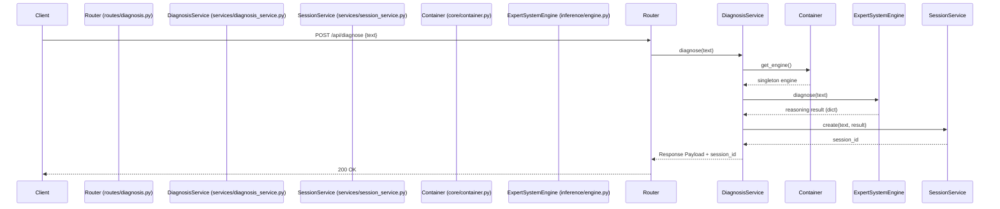
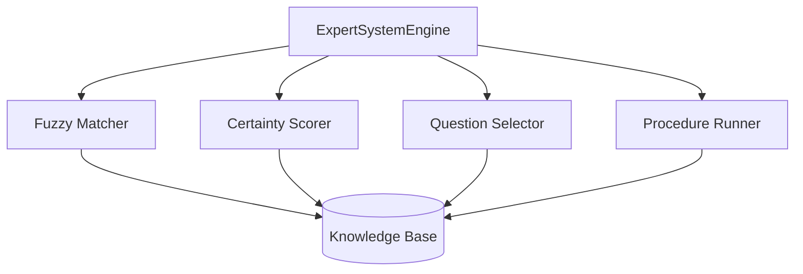

# Expert System Backend Architecture

This document describes the architecture of the modularized Expert System backend, outlining request lifecycle, state flow, boundaries, and system lifecycles.

## 1. Request Lifecycle & Routing Flow

Requests flow from the outer API layer inward to the core inference engine, maintaining a strict separation of concerns.

### Route -> Service -> Engine
1. **Router (`backend/routes/`)**: Handles HTTP specifics, request validation (Pydantic), and delegates to the Service layer.
2. **Service (`backend/services/`)**: Orchestrates the workflow. It manages the session (fetching/saving `SessionState`), applies business logic/policies (LLM fallbacks, filtering rejected candidates), and calls the Engine.
3. **Engine (`src/expert_system/inference/engine.py`)**: A pure stateless inference component. It takes inputs and memory state and returns a deterministic diagnosis dictionary without side effects like DB writes.

## 2. Inference Boundaries

The `ExpertSystemEngine` acts as a facade, delegating specific algorithmic tasks to internal modules. It never implements the algorithms directly.

- `inference/fuzzy.py`: Normalizes free-text into recognized `symptom_id`s.
- `inference/certainty.py`: Calculates MYCIN-style confidence scores given confirmed/rejected evidence.
- `inference/question.py`: Selects the next best symptom to ask about based on Information Gain.
- `inference/procedure.py`: Navigates strict diagnostic trees.

## 3. Runtime State Flow

State is managed ephemerally during inference (`WorkingMemory`) and persisted between requests (`SessionState`).

1. The API receives a request with a `session_id`.
2. `DiagnosisService` retrieves `SessionState` via `SessionService` (SQLite).
3. The `SessionState` (confirmed/rejected symptoms, question history) is converted into `WorkingMemory`.
4. `WorkingMemory` is passed to the `ExpertSystemEngine`. The engine mutates `WorkingMemory` internally as it reasons.
5. The engine returns a final diagnosis and a `reasoning_trace`.
6. `DiagnosisService` translates the result back into an updated `SessionState` and stores it.

## 4. Trace Lifecycle

Tracing is embedded directly within the inference cycle for exact observability.

1. `ExplanationBuilder` (`runtime/trace.py`) constructs the trace using immutable Pydantic models (`FuzzyTrace`, `CFTrace`, etc.) during the engine's execution.
2. The completed trace is returned as part of the engine's result.
3. `SessionService` persists this trace directly into the `diagnosis_sessions` table (`reasoning_trace` column).
4. **Debug Access**: The trace can be retrieved exactly as it was generated via `GET /debug/diagnosis/{session_id}/trace`. This endpoint is disabled in production unless explicitly allowed.

## 5. Singleton Engine Lifecycle

The `ExpertSystemEngine` and its underlying `KnowledgeBase` are heavy objects. 

- **Startup**: Loaded exactly once during the FastAPI `lifespan` context manager in `main.py`.
- **Storage**: Held in memory via `backend/core/container.py`.
- **Access**: Routes and services fetch the instance via `get_engine()`. The engine is never recreated per-request, ensuring high throughput and low latency.
- **Reloading**: Can be safely reset using `container.reset_engine()` without leaking state.

## 6. Compatibility Wrapper Strategy

To maintain backward compatibility with the existing frontend and mobile apps:

- **Naming**: The internal engine uses modern naming conventions (`confidence` instead of `final_cf`).
- **Response Schemas**: `DiagnosisResponse` continues to map `confidence` to both `confidence` and `final_cf` fields.
- **Wrappers**: Functions like `rank_faults` in `engine.py` are kept as wrappers around the new modular implementations in `certainty.py` to avoid breaking tests or legacy routes that might still import them directly.
